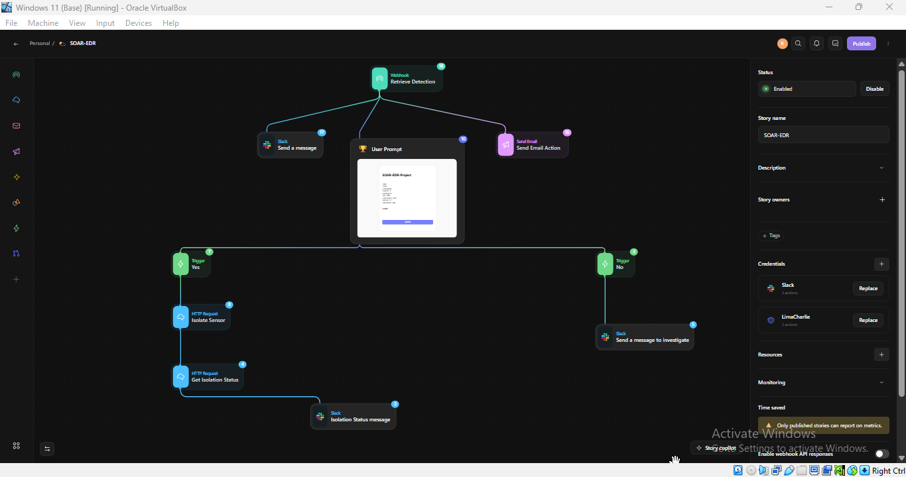
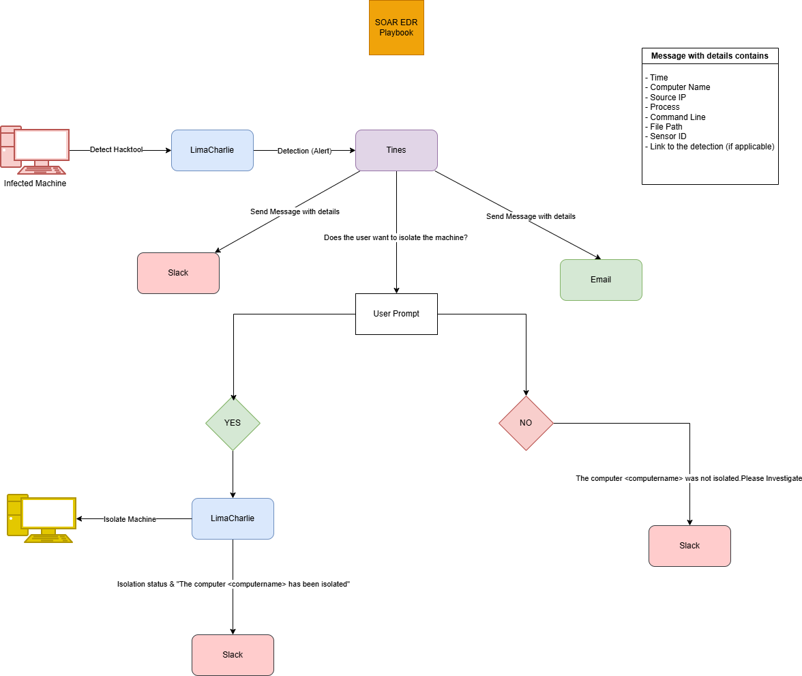
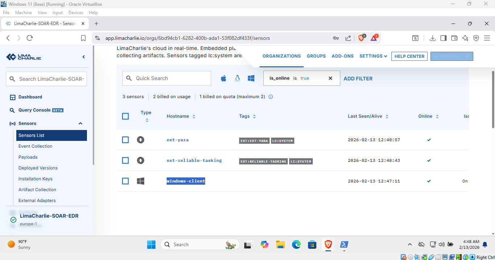
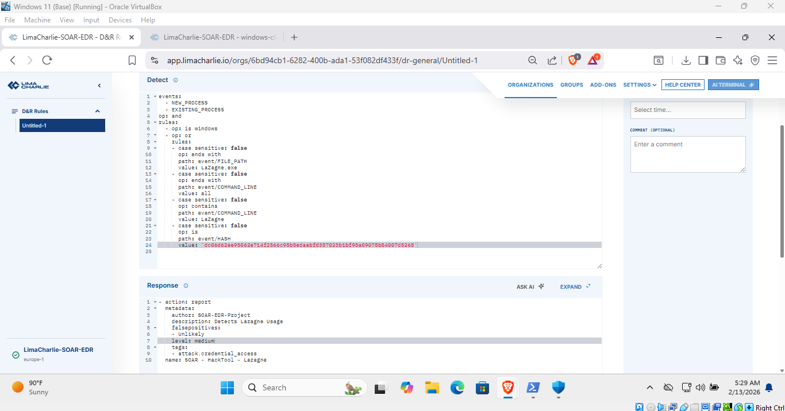
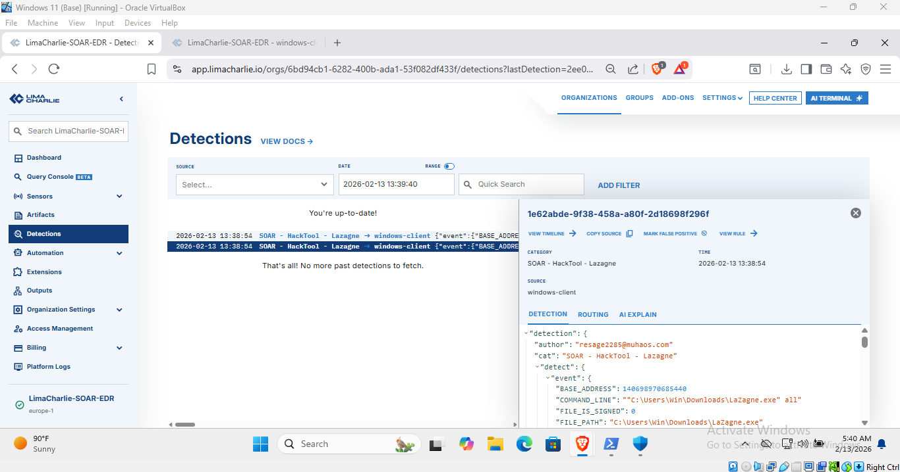
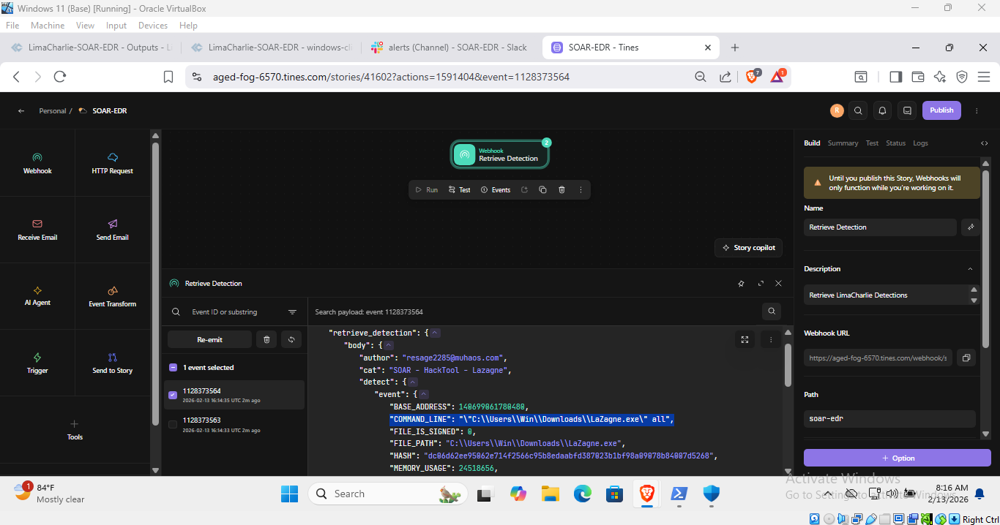
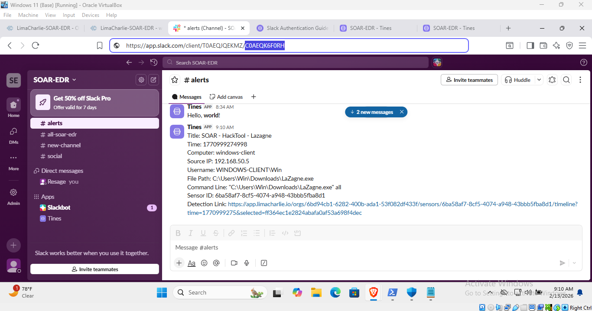
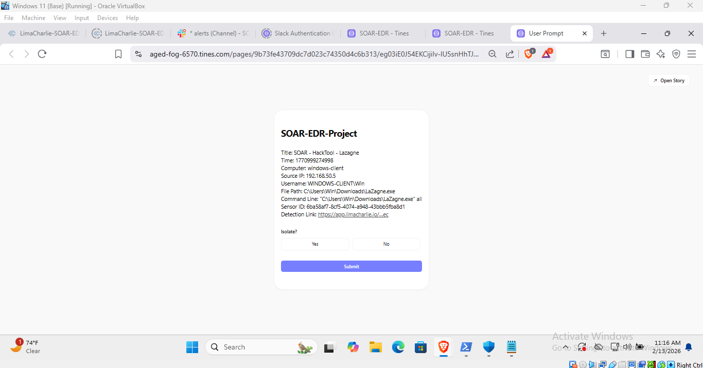
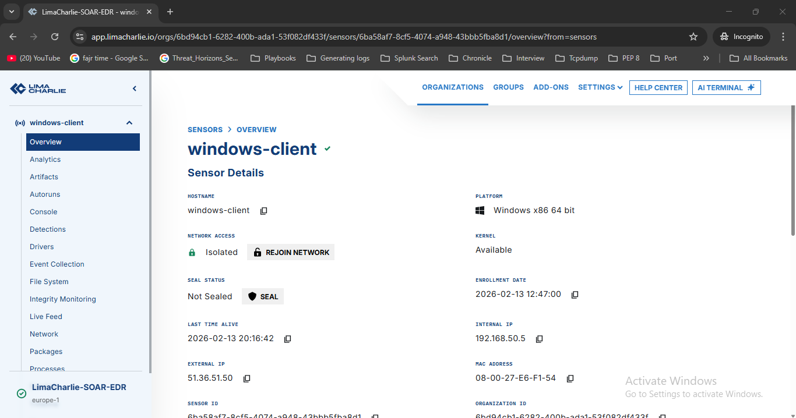
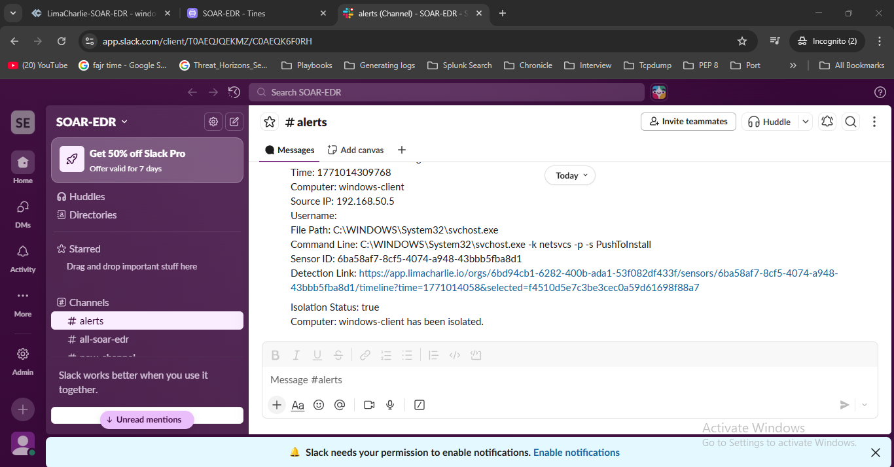

# 🛡️ EDR Detection & SOAR Response Lab — LimaCharlie × Tines × Slack

## TL;DR
Built an end-to-end **EDR + SOAR workflow** using LimaCharlie, Tines, and Slack.  
Simulated malware execution (LaZagne), created custom EDR detection rules, forwarded alerts into a SOAR platform, notified analysts via Slack and email, and implemented a **human-in-the-loop endpoint isolation response**.

*Figure: Tines SOAR Workflow* 

---

## Project Objectives
- Simulate malware execution on a Windows endpoint
- Detect malicious activity using EDR telemetry
- Build a SOAR pipeline for alerting and response
- Implement analyst approval before isolating an endpoint
- Validate isolation through network connectivity testing

---

## Lab Architecture

**Components**
- Windows Endpoint (infected host)
- LimaCharlie (EDR)
- Tines (SOAR)
- Slack (alerting & analyst visibility)

*Figure: Logical EDR → SOAR → Analyst response workflow* 

---

## Environment Setup

### LimaCharlie
- Created a new organization
- Generated installation keys
- Installed LimaCharlie sensor on the Windows endpoint
- Verified sensor connectivity in the Sensors dashboard
  

*Figure: Endpoint successfully reporting to LimaCharlie*

---

## Malware Simulation (Lasagna)

> ⚠️ Executed in an isolated lab environment with antivirus temporarily disabled for testing purposes.

Steps performed:
- Downloaded LaZagne malware from GitHub
- Executed:
  - `laZagne`
  - `laZagne all`
- Confirmed process execution via EDR telemetry

Generated telemetry included:
- New process events
- Command-line activity
- File hash indicators

---

## Detection Engineering (LimaCharlie)

### Detection Logic
The detection rule correlates multiple signals:
- OS = Windows
- Process path ends with `laZagne.exe`
- Command line contains `laZagne` or `laZagne all`
- Parent process correlation
- File hash match

**Detection Metadata**
- Severity: Medium  
- MITRE ATT&CK: Credential Access  
- False positives: Unlikely

*Figure: Custom detection rule configuration in LimaCharlie*

---

## Detection Validation
- Detection rule tested using sample events
- Confirmed live triggering after malware execution
- Detection visible in LimaCharlie detections feed

*Figure: Detection triggered after malware execution*

---

## SOAR Workflow (Tines)

### Ingestion
- Created a webhook-based story in Tines
- Configured LimaCharlie detection output to forward events to Tines
- Verified payload ingestion

*Figure: Detection payload received in Tines*

---

## Alerting (Slack & Email)

Automated actions:
- Sent enriched alerts to a Slack channel
- Delivered alert details via email

Alert content included:
- Detection title
- Timestamp
- Hostname
- Source IP
- Username
- File path
- Command line
- Sensor ID
- Detection link

 

*Figure: Alert delivered to Slack*

---

## Human-in-the-Loop Response

### Analyst Decision
Tines prompts the analyst:
> “Do you want to isolate this endpoint?”

Options:
- **No** → Slack message indicating further investigation required
- **Yes** → Proceed to endpoint isolation

*Figure: Analyst decision prompt*

---

## Automated Response — Endpoint Isolation

If approved:
- Tines authenticates to LimaCharlie via REST API
- Executes isolate sensor action using Sensor ID
- Endpoint is isolated from the network

Validation:
- Network connectivity tests (e.g., ping) fail as expected

*Figure: Endpoint isolation confirmed*

---

## Post-Response Verification
- Queried isolation status using LimaCharlie API
- Sent confirmation message to Slack indicating successful isolation

*Figure: Isolation status confirmation in Slack*

---

## Key Takeaways
- Combining process, command-line, and hash signals strengthens EDR detections
- Human approval reduces risk in automated response workflows
- SOAR platforms enable fast, consistent incident response
- Hands-on labs provide realistic SOC experience beyond theory

---

## Tools Used
- LimaCharlie (EDR)
- Tines (SOAR)
- Slack (Alerting)
- Windows Endpoint

---

## Final Notes
This lab focused on understanding **realistic EDR detection and SOAR response workflows**, emphasizing analyst control and telemetry-driven decision-making rather than perfect production infrastructure.
